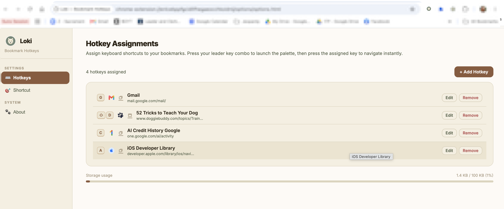
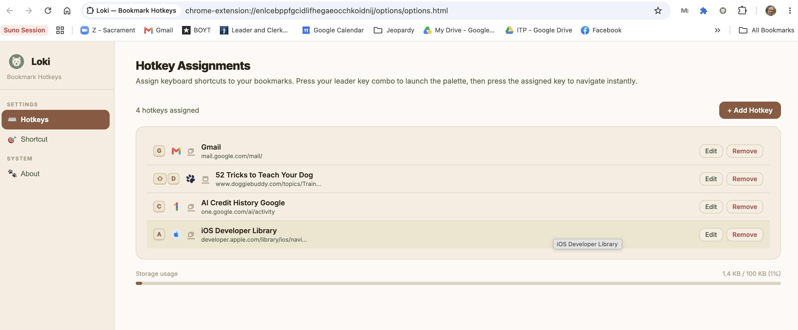
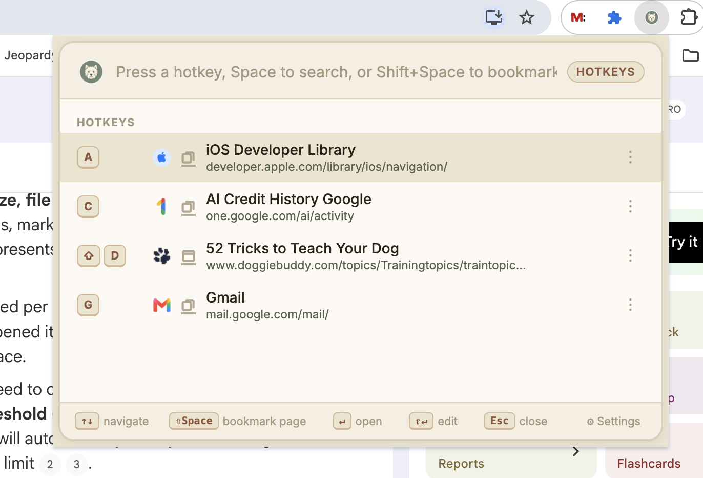

<p align="center">
  
</p>

<h1 align="center">Loki — Bookmark Hotkeys</h1>

<p align="center">
  <strong>A Raycast-style command palette for your Chrome bookmarks.</strong><br/>
  Press <kbd>⌘</kbd><kbd>⇧</kbd><kbd>L</kbd> to open, hit a hotkey, and you're there.
</p>

<p align="center">
  
  
  
  <a href="PRIVACY_POLICY.md"></a>
</p>

---

<p align="center">
  
</p>

<p align="center">
  
  
</p>

---

## ✨ Why Loki?

| Benefit | Description |
|---|---|
| ⚡ **Instant navigation** | Jump to any bookmark with a single keypress — no clicking, no searching |
| 🔎 **Built-in search** | Press `Space` to search all bookmarks when you don't remember the hotkey |
| 📁 **Folder support** | Drill into bookmark folders, open all tabs at once, or flatten to a list |
| 🔖 **One-click bookmarking** | Press `Shift+Space` to bookmark the current page and assign a hotkey in one step |
| 🎨 **Beautiful UI** | Warm, Westie-inspired color palette with automatic light/dark mode |
| 🌐 **Works everywhere** | Functions on all pages including `chrome://`, `file://`, and the Web Store |
| 🔄 **Syncs across devices** | Hotkeys are stored in Chrome Sync — they follow you everywhere |
| ⌨️ **Shared hotkeys** | Map multiple bookmarks to the same key to open them all simultaneously |

---

## 🚀 Installation & Setup

### Google Chrome
1. **Clone or download** this repository to your local machine.
2. Open Chrome and navigate to `chrome://extensions/`.
3. In the top-right corner, turn on **Developer mode** using the toggle switch.
4. Click the **Load unpacked** button in the top-left corner.
5. Select the repository root folder.
6. **Launch Loki** by pressing <kbd>⌘</kbd><kbd>⇧</kbd><kbd>L</kbd> (Mac) or <kbd>Ctrl</kbd><kbd>⇧</kbd><kbd>L</kbd> (Windows/Linux).

> **Tip:** Pin Loki to your toolbar for quick access via the Extensions puzzle-piece icon.

### Other Chromium Browsers
Because Loki is built on standard Manifest V3 WebExtensions APIs, it is **100% compatible with other Chromium-based browsers**:
- **Microsoft Edge**: Navigate to `edge://extensions/`, enable **Developer mode**, and click **Load unpacked**.
- **Brave Browser**: Navigate to `brave://extensions/`, enable **Developer mode**, and click **Load unpacked**.
- **Opera**: Navigate to `opera://extensions/`, enable **Developer mode**, and click **Load unpacked**.
- **Arc / Vivaldi**: Open the Extensions settings page, enable developer options, and select the project folder via the load unpacked button.

---

## 📖 How to Use

### Hotkey Mode (default)
Open the palette and press the assigned key to navigate instantly.

| Action | Shortcut |
|---|---|
| Open palette | <kbd>⌘</kbd><kbd>⇧</kbd><kbd>L</kbd> |
| Activate a hotkey | Press the assigned letter/digit |
| Navigate list | <kbd>↑</kbd> <kbd>↓</kbd> |
| Open selected | <kbd>Enter</kbd> |
| Edit selected | <kbd>⇧</kbd><kbd>Enter</kbd> |
| Bookmark current page | <kbd>⇧</kbd><kbd>Space</kbd> |
| Close | <kbd>Esc</kbd> |

### Search Mode
Press <kbd>Space</kbd> to switch to search mode and find any bookmark by title or URL.

### Settings
Click **⚙ Settings** in the footer (or right-click the extension icon → Options) to manage hotkey assignments, view storage usage, and customize your shortcut key.

---

## 🏗️ Architecture

```
┌──────────────────────────────────────────────────────────┐
│  Chrome Browser                                          │
│                                                          │
│  ┌─────────────────────────┐                             │
│  │  chrome.commands API    │ Catches Cmd+Shift+L         │
│  │  ("_execute_action")    │ (Handled natively by Chrome)│
│  └───────────┬─────────────┘                             │
│              │ Opens Action Popup                        │
│              ▼                                           │
│  ┌─────────────────────────┐                             │
│  │  palette/palette.html   │ Renders command palette     │
│  │  (Action Popup Window)  │ Handles search, hotkeys,   │
│  │  & palette.js           │ and direct tab navigation   │
│  └─────────────────────────┘                             │
│                                                          │
│  ┌────────────┐                                          │
│  │ options/   │ Settings page (managing bookmark keys)   │
│  └────────────┘                                          │
└──────────────────────────────────────────────────────────┘
```

Loki uses Chrome's **`_execute_action`** command to natively open the popup — no background messaging, no content scripts, no permissions beyond what's needed. This guarantees **100% compatibility** across all pages.

---

## 📂 File Structure

```
chrome-bookmark-hotkeys-extension/
├── manifest.json           # MV3 manifest — permissions, shortcuts, popup
├── background.js           # Service worker (placeholder for future use)
├── palette/
│   ├── palette.html        # Popup HTML structure
│   ├── palette.css         # Styles (Westie color theme, auto light/dark)
│   └── palette.js          # Palette logic: hotkey matching, search, navigation
├── options/
│   ├── options.html        # Full settings page with sidebar navigation
│   └── options.js          # Hotkey management and options page logic
├── shared/
│   └── storage.js          # Storage helpers (hotkeys CRUD, settings, utilities)
└── icons/
    ├── loki-16.png
    ├── loki-48.png
    └── loki-128.png        # Westie terrier mascot 🐾
```

---

## 🔑 Data Model

Hotkeys are stored in `chrome.storage.sync` (syncs across devices, 100 KB quota):

```json
{
  "hotkeys": [
    {
      "id": "loki-1720000000000-abc12",
      "bookmarkId": "12345",
      "url": "https://mail.google.com",
      "title": "Gmail",
      "isFolder": false,
      "folderBehavior": null,
      "key": { "code": "KeyG", "shift": false },
      "openIn": "new_tab"
    }
  ]
}
```

---

## 🛠️ Development

1. Edit files in this directory
2. Go to `chrome://extensions` → click **↺ Reload** on Loki
3. Press <kbd>⌘</kbd><kbd>⇧</kbd><kbd>L</kbd> to test the popup

No build step required — the extension runs directly from source.

---

## 📋 Chrome APIs Used

| API | Purpose |
|---|---|
| `chrome.bookmarks` | Search, create, update, remove bookmarks & folders |
| `chrome.commands` | Global keyboard shortcut (`_execute_action`) |
| `chrome.storage.sync` | Persist hotkeys & settings across devices |
| `chrome.tabs` | Open/navigate tabs |
| `chrome.windows` | Open bookmarks in new windows |
| `chrome.runtime` | Open options page, read manifest version |

---

## ⚠️ Known Constraints

| Constraint | Details |
|---|---|
| **Popup size** | Chrome limits action popups to **800×600px**. Loki uses **600×400px**. |
| **`file://` URLs** | Requires user opt-in: Extensions → Loki → "Allow access to file URLs" |
| **Storage quota** | `chrome.storage.sync` has a 100 KB limit (~500 hotkeys at ~200 bytes each) |

## 🔒 Privacy Policy

Loki does not collect, transmit, or share any personal data. All data operations (including reading your bookmarks, saving options, and tracking active tabs) are handled strictly locally on your browser. 

Read the full [PRIVACY_POLICY.md](PRIVACY_POLICY.md) for more details.

---

## 📄 License

This project is open-source and available under the [MIT License](LICENSE).

---

<p align="center">
  Built with 🐾 by a Westie and his human
</p>
